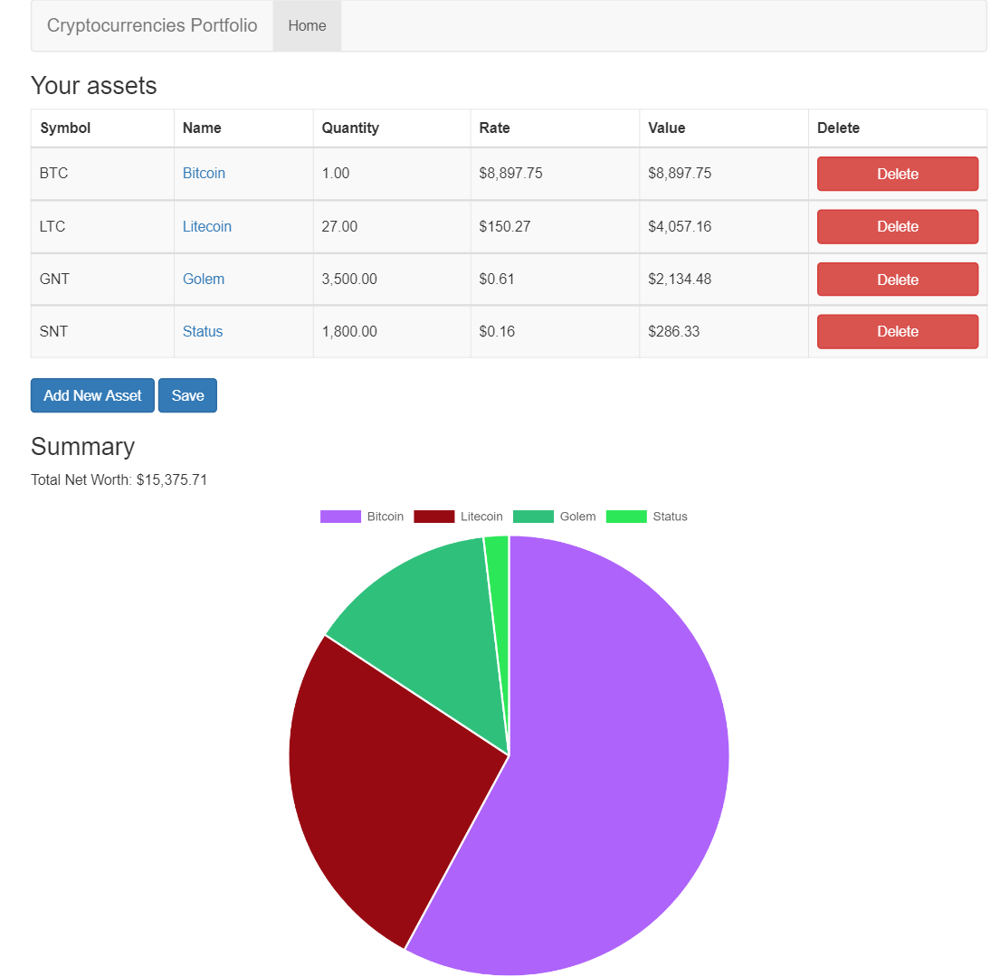

# Portfolio

This project lets users input their cryptocurrency assets, in the form of a coin and a quantity owned.

The website then allows easy monitoring of the investments' value, through a sorted table of investments and a pie chart showing the distribution of investments.

The website calls an external API to get the exchange rate of the coins owned by the user. 
This API call is automatically relaunched every 10 minutes to keep data up to date.

